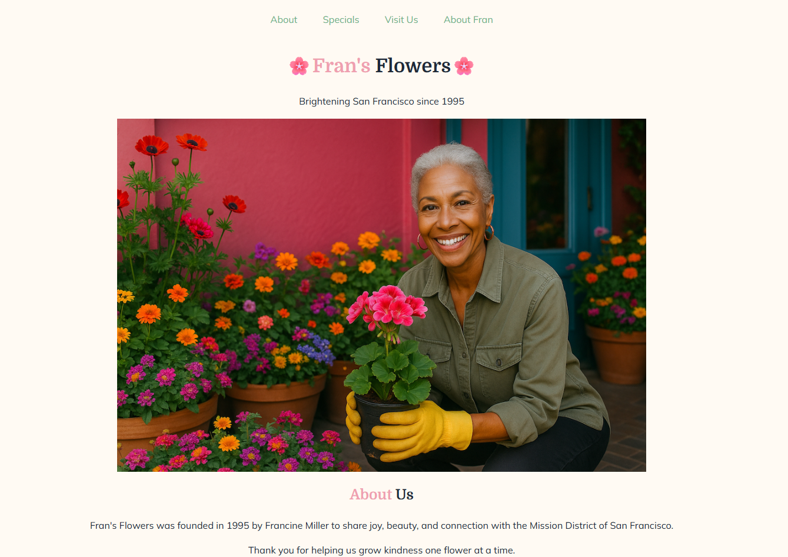

# 🌸 Fran’s Flowers — Website Redesign

A responsive website redesign for a boutique flower shop, focused on clean visual hierarchy, accessibility, and modern CSS layout techniques.  
This project emphasizes user experience, semantic HTML, and mobile-first styling without using JavaScript frameworks.

---

---

## ✨ Overview

This redesign reimagines the online presence of a local flower shop with a warm, inviting aesthetic and clear navigation.

Users can:
- Browse shop information, specials, and seasonal offerings
- Learn about the shop’s values and community impact
- View customer testimonials and featured products
- Easily find store location and contact information via an embedded map

The focus of this project is **CSS-driven layout**, **accessibility**, and **responsive design** using modern web standards.

---

## 🚀 Key Features

- **Modern Responsive Layout**
  - Mobile-first design that adapts smoothly across screen sizes
  - Flexible layouts using CSS Flexbox and Grid
  - Scales images responsively while preserving aspect ratios

- **Accessible & Semantic HTML**
  - Proper heading hierarchy and landmark elements
  - Keyboard-navigable links and focus states
  - Descriptive alt text and readable color contrast

- **Polished Visual Design**
  - Custom color palette aligned with a floral brand identity
  - Google Fonts pairing for headings and body text
  - Subtle UI accents to guide attention without clutter

- **Content-Rich Pages**
  - Dedicated sections for specials, seasonal picks, testimonials, and location
  - Secondary “About Fran” page highlighting brand story and values
  - Embedded Google Maps iframe for easy store navigation

---

## 🛠️ Technical Stack

- **Frontend:** HTML5, CSS3
- **Layout:** Flexbox and Grid
- **Typography:** Google Fonts
- **Accessibility:** Semantic markup and focus-visible styling
- **Assets:** Optimized images and icons

---

## 🧩 Architecture Notes

- Styles are organized in a single, maintainable CSS file.
- Layout responsiveness is achieved through media queries and flexible containers.
- Visual consistency is maintained using reusable classes and design tokens.
- No JavaScript is used, emphasizing strong fundamentals in HTML and CSS.

---

## ⚠️ Disclaimer

This project is a **demonstration website built for learning purposes**.  
It is **not an official business website** for Fran’s Flowers.

---

## 👤 Author

**Shivraj Jadeja**  
Software Engineering Apprentice – Global Career Accelerator
